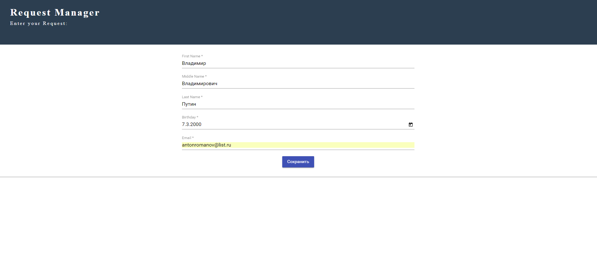

# JSON REST SERVICE [ANGULAR JS VERSION]

Rest-service for read data from Angular form by HTTP-POST request and read/write it to .json file. 

____
*I used here Material Design and Moment JS frameworks.

____


Run/Install application:
```
mvn clean install

mvn spring-boot:run
```
and open: http://localhost:8080


### Screenshot


