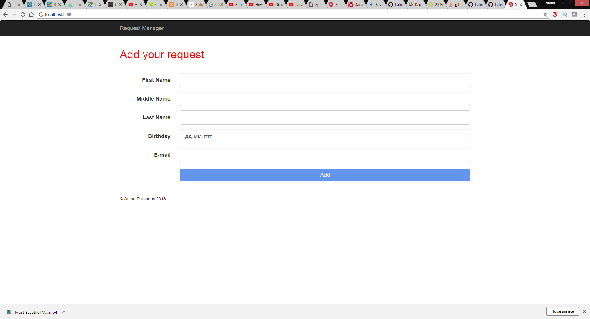

# JSON REST SERVICE [HTML JS VERSION]

Rest-service for read data from Angular form by HTTP-POST request and read/write it to .json file. 

____
*I used here classic HTML5 + CSS + JS

____


Run/Install application:
```
mvn spring-boot:run
```
and open: http://localhost:8080


### Screenshot


